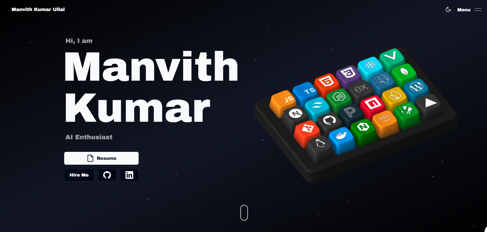

# 🚀 Manvith Kumar Ullal – Portfolio Website

Welcome to the repository for my **personal portfolio website**! 🎉  
This project showcases my skills, projects, achievements, and certifications through a **modern, interactive, and visually immersive experience**.

---

## 🌐 Live Preview

🔗 **Live Website:** https://your-domain-here.vercel.app  
*(Replace with your deployed link)*

---

## ✨ Inspiration

This portfolio is **inspired by** the creative work of  
👉 **Naresh Khatri** – https://github.com/Naresh-Khatri/Portfolio  

Huge thanks for the design inspiration and interaction ideas 🙏

---

## 🔥 Features

### 🎹 3D Interactive Skills Section
- Custom **3D keyboard built using Spline**
- Each key represents a technical skill
- Hover & keypress interactions reveal skill details
- GSAP-powered section transitions

### ✨ Smooth Animations & Interactions
- Scroll-based animations using **GSAP**
- Micro-interactions with **Framer Motion**
- Modal animations and smooth reveals

### 🌌 Space-Themed Dark UI
- Futuristic dark aesthetic
- Animated background elements
- Glassmorphism cards with glowing borders

### 📱 Fully Responsive Design
- Optimized for desktop, tablet, and mobile
- Adaptive 3D scaling for smaller screens

### 🧠 Clean & Scalable Architecture
- Modular components
- Reusable UI patterns
- Easy customization and extension

---

## 🛠️ Tech Stack

**Frontend**
- Next.js
- React
- TypeScript
- Tailwind CSS
- Shadcn UI
- Aceternity UI

**Animations & 3D**
- GSAP
- Framer Motion
- Spline Runtime

**Backend / Utilities**
- Resend
- Socket.io
- Zod

---

## 📁 Project Structure (Highlights)

public/
└── assets/
├── achievements/
├── icons/
├── nav-link-previews/
│ └── about.png
├── projects-screenshots/
├── seo/
└── skills-keyboard.spline

src/
├── app/
├── components/
├── data/
├── hooks/
└── lib/

## 🚀 Getting Started

### 1. Clone the repository

```bash
git clone https://github.com/your-username/portfolio.git

2. Install dependencies
bash

npm install
3. Environment Variables
Create a .env.local file in the root directory:

env

RESEND_API_KEY=your_resend_api_key_here
4. Run the development server
bash
Copy code
npm run dev
Open your browser at:
👉 http://localhost:3000

🚀 Deployment
This project is deployed using Vercel for fast performance and easy CI/CD.

Resend Setup on Vercel
Open Vercel Dashboard

Go to your project → Settings

Add a new environment variable:

Name: RESEND_API_KEY

Value: Your Resend API key

Redeploy the project

🏆 Highlights
Interactive 3D keyboard UI

Skill-based hover & keypress animations

Projects with animated modals

Certificates & achievements showcase

Smooth navigation & transitions

📬 Contact
Name: Manvith Kumar Ullal

GitHub: https://github.com/Manvith-kumar16

Email: your-email@gmail.com

LinkedIn: https://www.linkedin.com/in/your-link-here

⭐ If you like this portfolio, don’t forget to star the repository — it really helps! 😊

yaml
Copy code

---

If you want next, I can add:
- ✅ GitHub badges (stars, forks, tech stack)
- 🎥 Embedded preview GIF / video
- 🌐 SEO + OG image section
- 📄 Resume PDF download section
- 🧠 “How the 3D keyboard works” explanation

Just tell me 🚀
