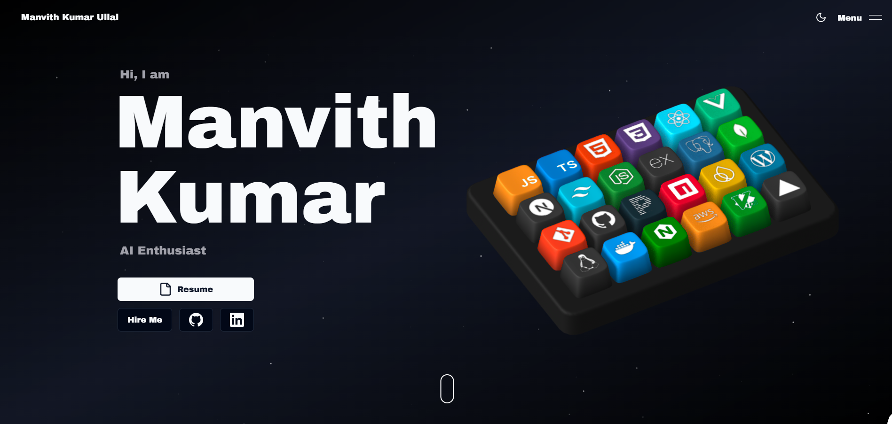

# 🚀 Manvith Kumar Ullal – Portfolio Website



[](https://nextjs.org/)
[](https://www.typescriptlang.org/)
[](https://tailwindcss.com/)
[](https://greensock.com/gsap/)

Welcome to the repository for my **personal portfolio website**! 🎉  
This project showcases my skills, projects, achievements, and certifications through a **modern, interactive, and visually immersive experience**.

---

## 🌐 Live Preview

🔗 **Live Website:** [https://manvith-kumar.vercel.app/](https://manvith-kumar.vercel.app/)  

---
## 🔥 Features

### 🎹 3D Interactive Skills Section
- **Spline-Powered Keyboard:** Custom 3D keyboard model.
- **Real-time Interaction:** Each key represents a technical skill with hover & keypress reveals.
- **GSAP Integration:** Smooth camera transitions between keyboard views.

### ✨ Smooth Animations & Interactions
- **GSAP & Framer Motion:** Seamless scroll-based animations and micro-interactions.
- **Aceternity UI:** High-quality, ready-made animated components.
- **Glassmorphism:** Elegant dark UI with glowing borders and frosted glass effects.

### 📱 Responsive & Optimized
- **Mobile First:** Adaptive 3D scaling for smaller screens.
- **Performance:** Optimized image loading and modular component architecture.

---

## 🛠️ Tech Stack

| Category | Tech Used |
| :--- | :--- |
| **Frontend** | Next.js, React, TypeScript, Tailwind CSS |
| **UI Library** | Shadcn UI, Aceternity UI |
| **Animations** | GSAP, Framer Motion |
| **3D Design** | Spline Runtime |
| **Utilities** | Resend (Email), Socket.io, Zod |

---

## 📁 Project Structure 

```text
public/
├── assets/
│   ├── achievements/          # Certificate images
│   ├── nav-link-previews/     # OG & Preview images
│   ├── projects-screenshots/  # Project thumbnails
│   └── skills-keyboard.spline # 3D Spline model
src/
├── app/          # Next.js App Router (Pages & Layouts)
├── components/   # Reusable UI components
├── data/         # Mock data for projects & skills
├── hooks/        # Custom React hooks
└── lib/          # Utility functions (Zod schemas, etc.)

```

---

## 🚀 Getting Started

### 1. Clone the repository

```bash
git clone https://github.com/Manvith-kumar16/Portfolio
cd portfolio

```

### 2. Install dependencies

```bash
npm install

```

### 3. Environment Variables

Create a `.env.local` file in the root directory:

```env
NEXT_PUBLIC_EMAILJS_SERVICE_ID=your_service_id_here
NEXT_PUBLIC_EMAILJS_TEMPLATE_ID=your_template_id_here
NEXT_PUBLIC_EMAILJS_PUBLIC_KEY=your_public_key_here
```

### 4. Run the development server

```bash
npm run dev

```

Open your browser at: 👉 [http://localhost:3000](https://www.google.com/search?q=http://localhost:3000)

---

## 📬 Contact

**Email:** manvithkumar.u@gmail.com  
**LinkedIn:** https://www.linkedin.com/in/manvith-kumar16/

---
